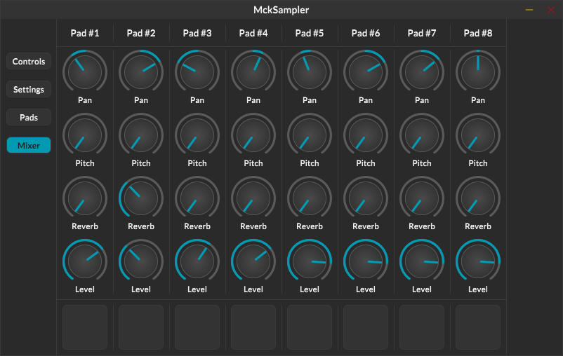

# MckSampler



## Description

MckSampler is a software drum machine that is tailored to be used with multitouch capable devices like convertibles or tablets. 
MckSampler allows the user to trigger drum samples in WAV format with 8 different pads. 
The samples can also be triggered with MIDI note messages or through the integrated sequencer.

MckSampler creates its configuration in the folder ```$HOME/.mck/sampler/config.json```.

MckSampler reads one shot samples from the folder ```$HOME/.local/share/mck/sampler/```. These samples should be arranged in subfolders and need to have a configuration file with the extension  ```.mcksp```. Some ready-to-use samplepacks can be found in the [MckSamplePacks](https://github.com/MckAudio/MckSamplePacks) repository. To use the MckSamplePacks with MckSampler just run:
```
git clone https://github.com/MckAudio/MckSamplePacks $HOME/.local/share/mck/sampler
```

## Build Dependencies

### Submodules
```
git submodule update --init --recursive
```

### Debian / Ubuntu
```
sudo apt install build-essential node npm git
sudo apt install libsamplerate0-dev libsndfile1-dev libjack-jackd2-dev
sudo apt install libgtk-3-dev libwebkit2gtk-4.0-dev
```

### Fedora
```
sudo dnf install make automake libtool gcc-c++ nodejs npm git
sudo dnf install libsamplerate-devel libsndfile-devel jack-audio-connection-kit-devel
sudo dnf install gtk3-devel webkit2gtk3-devel
```

### Manjaro / Arch
```
sudo pacman -Sy gcc make automake gdb nodejs npm git
sudo pacman -S libsamplerate libsndfile jack2
sudo pacman -S gtk3 webkit2gtk
```

### MacOS
```
brew install libsndfile libsamplerate
```

## Getting started

```
mkdir build
cd build
cmake ..
cmake --build . -j4
```

## Features (including planned stuff)

- [x] JSON config file
- [x] Samplerate conversion
- [x] WAV file import
- [x] GUI using Webkit2GTK and Svelte
- [ ] Sample import from any directory
- [ ] Choke groups (stop one sample if another is triggered)
- [ ] N * 16 Step Sequencer
  - [ ] Listen to Jack Transport
  - [ ] Lead Jack Transport
  - [ ] Polyrhythm with variable step length 
- [ ] Modification / FX per pad
  - [x] Delay
  - [x] Compressor
  - [x] sample length and sample direction
  - [ ] ADSR
  - [ ] Pitch
  - [ ] LowPass Filter
